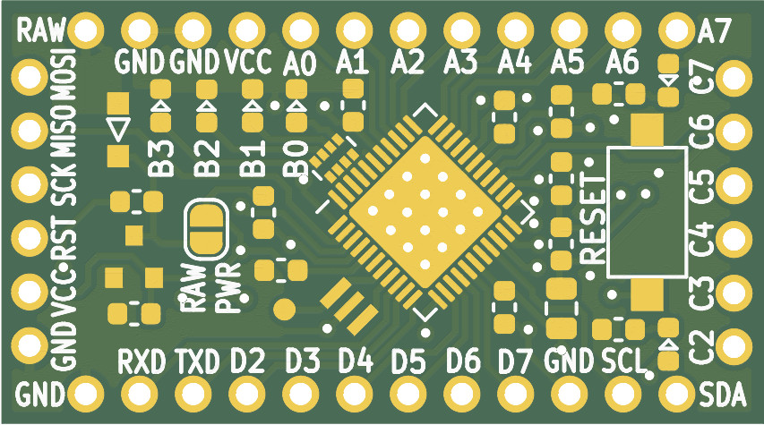
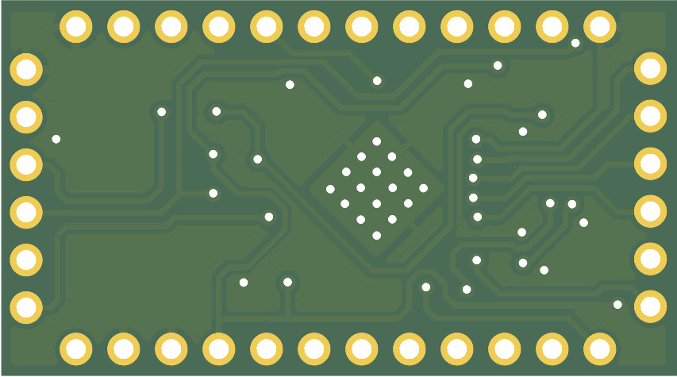
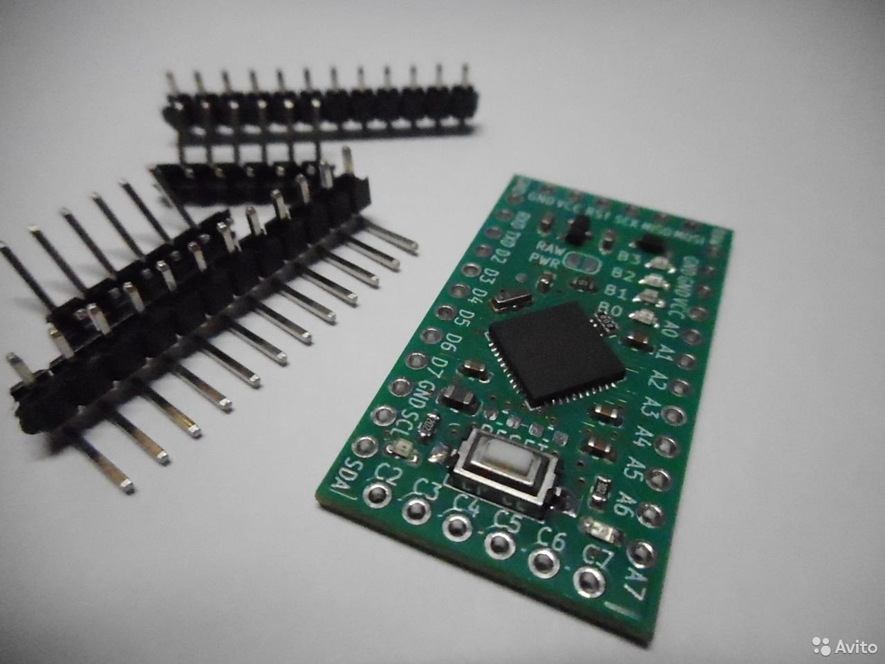

# ATmega1284p Development Board #

ATmega1284p provides maximum AVR capabilities in small QFN44 package only 7х7 mm size. This controller is much better than other Atmel AVR devices (ATmega128, ATmega328, ATmega32 etc).

## Board description ##

* Programm flash size: 128 кБ
* RAM size: 16 кБ
* EEPROM size: 4кБ
* CPU clock frequency: up to 20 MHz.
* Power supply voltage: 4...6 V
* Power supply polarity protection
* Power supply filter
* 24 I/O ports
* 6 LEDs (1 power + 5 configurable)
* Reset button
* Pads for ADC reference resistors
* SPI interface
* Dimensions: 36 х 20 х 4 mm

This repository contains
* OM-128 development board schematics;
* OM-128 PCB design in Gerber format;
* a default firmware for OM-128 development board.

## PCB ##

Front view

  

Rear view

  

## Available for purchasing ##

https://www.avito.ru/krasnodar/tovary_dlya_kompyutera/otladochnyy_modul_avr_atmega1284p_1904795755

  

